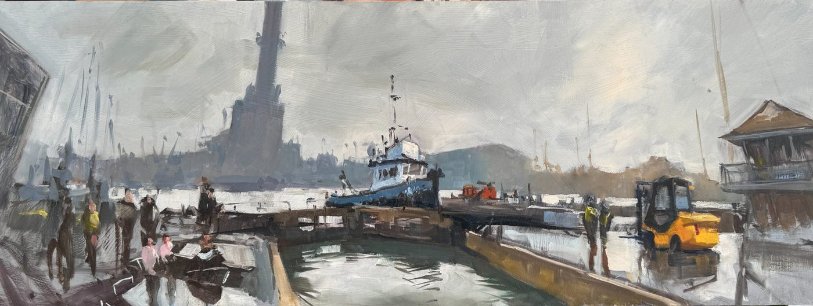

# Seat of Power — Website Code Addition

Image filename: `shoreham-seat-of-power.jpg`
Upload to: `/images/` folder in your GitHub repo

---

## map.html — New pin

Paste into your pins array with the other UK/Sussex pins:

```javascript
{
  lat: 50.830527,
  lng: -0.238064,
  title: "Seat of Power, Shoreham Harbour",
  image: "images/shoreham-seat-of-power.jpg",
  collection: "Sussex"
},
```

---

## If you have a Sussex / UK collection page

```html
<div class="painting-card">
  
  <div class="painting-info">
    <h3>Seat of Power</h3>
    <p>Oil on board · 80×30cm · Shoreham Harbour, Sussex</p>
    <p>Tug boat, lock gates and Shoreham Power Station — painted plein air in the mist</p>
  </div>
</div>
```

---

## Note on collection

This one doesn't obviously sit in Alps, Amalfi or Bahamas. 
If you don't have a Sussex/local page yet, worth noting — you're 
accumulating enough home-territory work (Undercliff, Saltdean, now 
Shoreham) that a Sussex collection page is becoming worth building.
